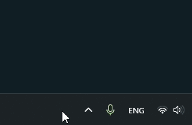
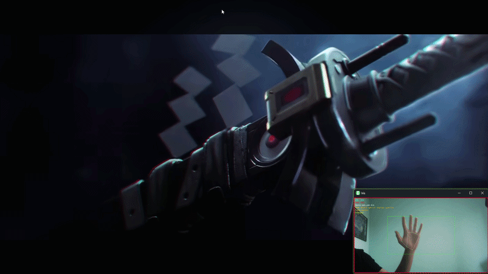
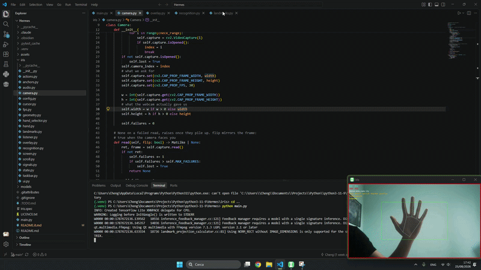
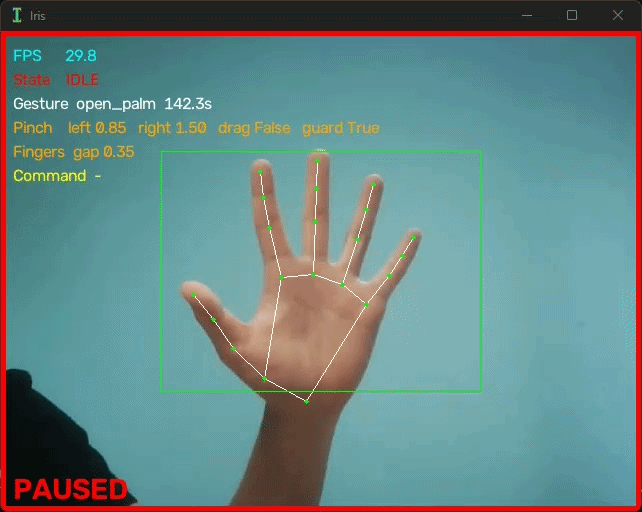
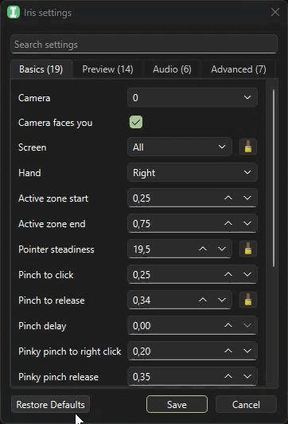

<p align="center">
  
</p>

# Iris

*Control your desktop in a different way.*

[🇬🇧 English](README.md) · [🇮🇹 Italiano](README.it.md)

## Table of contents
- [What is Iris](#what-is-iris)
- [Privacy notice](#privacy-notice)
- [Quick start](#quick-start)
- [How to use it](#how-to-use-it)
- [States and gestures](#states-and-gestures)
- [Settings](#settings)
- [Limitations](#limitations)
- [Uninstalling](#uninstalling)
- [Building from source](#building-from-source)
- [License](#license)
- [Development and author's notes](#development-and-authors-notes)
- [Contact](#contact)

## What is Iris

Ever eaten in front of your PC with greasy hands and still wanted to switch tabs, change the volume, or pause a video, without cleaning your hands first to touch the mouse and keyboard? Or maybe your desk is small, and while you study or work, the mouse and keyboard end up pushed somewhere awkward to reach?

Iris was built for exactly that: it uses your webcam to recognize hand gestures and lets you control the cursor and a few desktop functions with gestures, without touching anything.

## Privacy notice

**Iris does not collect or send webcam images over the Internet.** All processing happens locally, on your own computer.

## Quick start

Iris has currently only been tested on **Windows 11**. All you need is a working webcam.

There's no installer:
1. Download the `.zip` from the latest [release](https://github.com/Cheng98989/Iris/releases/latest).
2. Extract it into a folder of your choice.
3. Run `Iris.exe`.

> **Note:** `Iris.exe` isn't digitally signed, so on first launch Windows may show the "Windows protected your PC" warning. To go ahead: **More info** → **Run anyway**. For the same reason, some antivirus software may quarantine the file.

On first launch, Iris automatically creates the folder holding the app's data inside `%appdata%\Iris` (see [Uninstalling](#uninstalling)).

## How to use it

On startup, after a moment, the preview window with the camera stream appears, if [Open preview at start](#par-show-preview) is on. If Iris can't find any webcam, the preview shows an error message. Closing the preview window doesn't close Iris: the app keeps running in the background.

Click Iris' icon in the system tray to open the dropdown menu, which has four options:
- **Preview** — show or hide the preview window.
- **Settings** — open the [settings](#settings) panel.
- **Restart** — restart the application.
- **Quit** — actually close the application.


*Iris' icon in the system tray, with its dropdown menu.*

**F12** pauses the app: the state stays locked on **[Idle](#state-idle)**; landmarks and gestures keep being recognized, but they aren't acted on, precisely because the state is Idle.

> **Warning:** in case of misrecognized gestures that could cause issues, the **Esc** key on your keyboard is always listened for and will close the app even while it's running in the background.

## States and gestures

Iris works as a state machine: at any moment you're in one specific state, and only certain gestures — held for a set number of seconds — move you to the next one.

| State | What it does | Border colour | Sound |
| --- | --- | --- | --- |
| <a id="state-idle"></a>**Idle** | Resting state and starting state: Iris watches but doesn't interact with the desktop. | Red | `default_D#4vH.wav` |
| <a id="state-active"></a>**Active** | Recognizes the [gestures](#active) for volume up/down and for media play/pause. | Green | `default_F#4vH.wav` |
| <a id="state-cursor"></a>**Cursor** | The mouse pointer follows your hand; you can left- and right-click, drag included, across multiple monitors (see the [gestures](#cursor)). | Blue | `default_A4vH.wav` |
| <a id="state-scroll"></a>**Scroll** | An imitation of the mouse wheel (see the [gestures](#scroll)). | Yellow | `default_C5vH.wav` |
| <a id="state-unknown"></a>**Unknown** | A state that, bugs aside, should never appear. | — | — |

Colours and sounds are changed in the [settings](#settings), in the [Preview](#preview) and [Audio](#audio) tabs respectively.

### Transitions

Every row is a possible move: the gesture must be held for the time given. Combinations that don't appear have no direct move.

| From | To | Gesture | Time |
| --- | --- | --- | --- |
| [Idle](#state-idle) | [Active](#state-active) | [Open palm](#gesture-open-palm) | 1 s |
| [Active](#state-active) | [Cursor](#state-cursor) | [Point](#gesture-point) | 0.5 s |
| [Active](#state-active) | [Idle](#state-idle) | [Fist](#gesture-fist) | 1 s |
| [Cursor](#state-cursor) | [Scroll](#state-scroll) | [Victory closed](#gesture-victory-closed) | 0.3 s |
| [Cursor](#state-cursor) | [Active](#state-active) | [Open palm](#gesture-open-palm) | 0.5 s |
| [Scroll](#state-scroll) | [Cursor](#state-cursor) | [Point](#gesture-point) or [Victory](#gesture-victory) | 0.2 s |
| [Scroll](#state-scroll) | [Active](#state-active) | [Open palm](#gesture-open-palm) | 0.5 s |
| [Active](#state-active), [Cursor](#state-cursor) or [Scroll](#state-scroll) | [Idle](#state-idle) | hand no longer detected | 2 s |

### Gestures by state

#### Active

Gestures available in the **[Active](#state-active)** state:

| Gesture | Action | Notes |
| --- | --- | --- |
| [Victory](#gesture-victory) | Volume up | Held 0.5 s, then repeats every 0.3 s while the gesture holds |
| [Victory closed](#gesture-victory-closed) | Volume down | Held 0.5 s, then repeats every 0.3 s while the gesture holds |
| [Three](#gesture-three) | Media play/pause | Held 0.5 s, a single action with no repeat |


*Media control in the Active state: volume and play/pause.*

#### Cursor

Gestures available in the **[Cursor](#state-cursor)** state:

| Gesture | Action | Notes |
| --- | --- | --- |
| [Index pinch](#gesture-index-pinch) | Click / Drag / Release, left button | — |
| [Pinky pinch](#gesture-pinky-pinch) | Click / Release, a single action, right button | — |
| — | Pointer movement | For as long as you're in [Cursor](#state-cursor), the pointer follows the average position of the middle and ring knuckles, for steadier movement |

#### Scroll

Gestures available in the **[Scroll](#state-scroll)** state:

| Gesture | Action | Notes |
| --- | --- | --- |
| [Victory closed](#gesture-victory-closed) | Scroll | A line appears in the preview, and the scrolling depends on where your fingertips sit relative to it. On entering [Scroll](#state-scroll) the action is already recognized. To move the line's reference you can release [Victory closed](#gesture-victory-closed) for a brief moment and move your fingers: the line settles roughly between the first and the second phalanx |


*Pointer movement, clicks and scrolling in the Cursor and Scroll states.*

At the moment, hold times and the gestures tied to states and actions aren't configurable from the interface: changing them requires editing the source code.

### Gesture table

How each gesture is performed. The internal name is the one used in the source code and in the preview's *Show the gesture* line; the thresholds point to the matching entry in the [settings](#settings).

| Gesture | Internal name | How to perform it |
| --- | --- | --- |
| <a id="gesture-open-palm"></a>**Open palm** | `open_palm` | Index, middle, ring and little finger extended; the distance between thumb and little finger must exceed the [Pinky pinch release](#par-pinky-pinch-open) threshold. |
| <a id="gesture-fist"></a>**Fist** | `fist` | Index, middle, ring and little finger closed into a fist. |
| <a id="gesture-point"></a>**Point** | `point` | Index finger only extended. |
| <a id="gesture-victory"></a>**Victory** | `victory` | Index and middle extended, with the distance between the second phalanges greater than the [Fingers apart](#par-fingers-apart) threshold. |
| <a id="gesture-victory-closed"></a>**Victory closed** | `victory_closed` | Index and middle extended, with the distance between the second phalanges smaller than the [Fingers together](#par-fingers-joined) threshold. |
| <a id="gesture-three"></a>**Three** | `three` | Index, middle and ring finger extended. |
| <a id="gesture-index-pinch"></a>**Index pinch** | — | With middle, ring and little finger either all extended or all closed, bring the index fingertip towards the thumb tip until the distance falls below [Pinch to click](#par-pinch-close); the release fires once the distance exceeds [Pinch to release](#par-pinch-open). It isn't a pose of its own: only the distance between the two fingertips counts. |
| <a id="gesture-pinky-pinch"></a>**Pinky pinch** | `pinky_pinch` | Hand almost at [Open palm](#gesture-open-palm), but with the distance between thumb and little finger already below the [Right click ready](#par-pinky-ready-close) threshold (this keeps the [Cursor](#state-cursor) state). Bringing the thumb tip closer still to the little fingertip, within [Pinky pinch to right click](#par-pinky-pinch-close), fires the click; the release happens beyond [Pinky pinch release](#par-pinky-pinch-open). |


*How to perform the gestures Iris recognizes.*

## Settings

The panel opens from the **Settings** entry in the tray menu and is split into four tabs: [Basics](#basics), [Preview](#preview), [Audio](#audio) and [Advanced](#advanced). The search bar at the top filters by keywords found in the displayed name, in the tooltip, or in the internal name used in the code; the number next to each tab says how many entries are still visible.

Every parameter has a tooltip (hover over it to read). If a tooltip is missing or unclear, feel free to report it.

Next to a parameter that is no longer at its default value, a button appears to take it back; **Restore Defaults**, at the bottom of the window, takes them all back at once. Some settings only take effect after a restart: saving asks for confirmation, then the app restarts.


*Iris' settings panel.*

### Basics

| Parameter | Description |
| --- | --- |
| Camera | Which webcam to use, counting from zero. |
| Camera faces you | Mirrors the image; turn it off if the webcam doesn't face you. |
| Screen | Which monitor the active zone covers: `Primary` for the main one, `All` for the whole desktop, or one of the detected monitors, listed with its resolution and position. |
| Hand | Which hand Iris follows; the other is ignored. |
| Active zone start / end | The portion of the frame that maps to the screen; a wider zone gives finer control but needs more hand travel. |
| Pointer steadiness | Minimum pixel movement before the pointer starts following your hand. |
| <a id="par-pinch-close"></a>Pinch to click | How close thumb and index must get to register a click. |
| <a id="par-pinch-open"></a>Pinch to release | How far apart they must get to release the click; must be larger than the threshold above. |
| Pinch delay | Seconds to hold before the click registers. |
| <a id="par-pinky-pinch-close"></a>Pinky pinch to right click | How close thumb and little finger must get to register a right click. |
| <a id="par-pinky-pinch-open"></a>Pinky pinch release | How far apart they must get to release the right click; must be larger than the threshold above. |
| <a id="par-pinky-ready-close"></a>Right click ready | Within this distance between thumb and little finger, Iris stays in the [Cursor](#state-cursor) state. |
| Right click ready release | How far the thumb must spread to leave that state. |
| <a id="par-fingers-joined"></a>Fingers together | How close index and middle must be to trigger scrolling. |
| <a id="par-fingers-apart"></a>Fingers apart | How far apart they must be to stop scrolling. |
| Scroll speed | Scroll clicks per second at full tilt. |
| Scroll range | How far to tilt your hand to reach full speed. |
| Scroll deadzone | Tolerance margin before scrolling actually starts. |

### Preview

| Parameter | Description |
| --- | --- |
| <a id="par-show-preview"></a>Open preview at start | Show the preview window on launch. |
| Draw the hand skeleton | Draws the hand skeleton in the preview. |
| Show the frame rate | How many frames a second the recognizer keeps up with. |
| Show the state | The current state — [Idle](#state-idle), [Active](#state-active), [Cursor](#state-cursor) or [Scroll](#state-scroll) — in the colour of the border. |
| Show the gesture | The gesture being recognized and how long it has been held. |
| Show the pinch distances | Thumb to index and thumb to little finger; use these to tune the clicks. |
| Show the finger gap | Index to middle: below the threshold the two count as joined, and scrolling starts. |
| Show the last command | The media key that fired most recently. |
| Show the pointer target | The pixel the cursor is being sent to, and the scroll speed. |
| Draw the active zone | Draws the active zone in the preview. |
| Idle / Active / Cursor / Scroll | The colour of the preview border for each state. |

### Audio

| Parameter | Description |
| --- | --- |
| Play sounds | Ring on every state change. |
| Audio volume | Volume of the sound played during state transitions. |
| Idle / Active / Cursor / Scroll | The `.wav` file tied to each state: the ▶ button plays it, the folder one picks another. |

### Advanced

| Parameter | Description |
| --- | --- |
| Detection confidence | How confident Iris must be before reporting a detected hand. |
| Presence confidence | How confident it must be that the hand is still present. |
| Tracking confidence | How confident it must be to keep following the same hand. |
| Pointer smoothing | Lower values keep the pointer steadier at rest, at the cost of more lag. |
| Pointer responsiveness | Higher values follow fast movements more closely. |
| Recognition smoothing | The same, but for gesture recognition. |
| Recognition responsiveness | Beta scales with the signal; here the unit is metres. |

As an alternative to the restore buttons, you can delete the configuration file:
1. Press `Win + R`, type (or paste) the following path, and press Enter:
   ```
   %appdata%
   ```
2. Go into the `Iris` folder and delete `config.json`.
3. Restart Iris: the file will be recreated with default values.

## Limitations

Iris can't move the pointer over windows that run with administrator privileges. Windows prevents it on purpose, and there are two separate cases.

**The administrator privileges prompt.** When Windows asks you to confirm an elevation, it switches to a separate, protected desktop where no application can send input. The pointer doesn't answer your gestures there, and there is no way around it: that screen exists precisely so that no software can answer on your behalf. Use the mouse and the keyboard to confirm or cancel.

**The windows of apps started as administrator.** An ordinary application can't send input to a window with higher privileges, so the pointer stays put for as long as one of those is in the foreground. It answers again as soon as you switch to another window.

If you need gesture control over those applications too, start Iris by right-clicking `Iris.exe` → **Run as administrator**. That only covers the second case: the privileges prompt stays out of reach either way.

## Uninstalling

1. Delete the folder where you extracted Iris.
2. If you also want to remove the configuration data, delete the `Iris` folder inside `%appdata%` too.

## Building from source

Clone the repository:
```
git clone https://github.com/Cheng98989/Iris.git
cd Iris
```

Create/activate a Python environment (developed with 3.11.8) and install the required dependencies, including `pyinstaller`. Then build:
```
pyinstaller Iris.spec
```

The output — everything needed to run the app — will be in the `dist` folder.

## License

Distributed under the [**GPL-3.0-or-later**](LICENCE.txt) license.

## Development and author's notes

The project started as a way to learn Python; it's also a school project, so whether development continues (also) depends on my discipline — there's no guarantee of ongoing maintenance.

While developing, I used AI as support, mainly for learning purposes: no vibecoding — the AI was a sounding board to discuss functions and solve problems, not something that wrote the project for me. AI was also used for documentation in the source code and the README; the final content has all been reviewed by me either way.

Built with:
- Python 3.11.8
- PySide6
- MediaPipe
- OpenCV
- Pynput

## Contact

For bug reports, questions, or suggestions, open an issue on GitHub.
